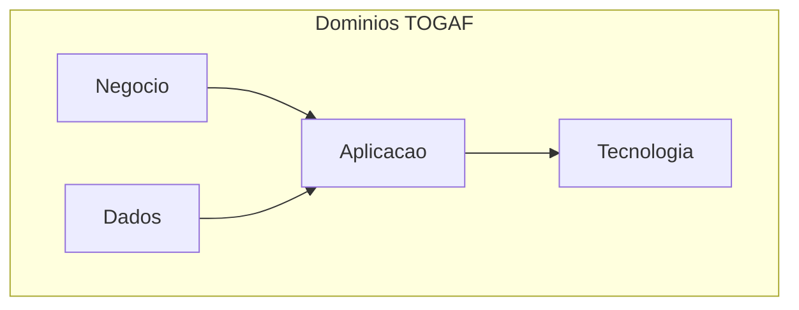

# Arquitetura — Minuto Offline

Documentação alinhada ao **TOGAF ADM** (Architecture Development Method).

## Mapa de documentos

| Fase TOGAF | Documento |
|------------|-----------|
| Visão | [vision.md](vision.md) |
| B — Negócio | [business.md](business.md) |
| C — Dados | [data-model.md](data-model.md) |
| D — Aplicação | [application.md](application.md) |
| E — Tecnologia | [technology.md](technology.md) |

## Modelo C4

| Nível | Documento |
|-------|-----------|
| 1 — Contexto | [c4/context.md](c4/context.md) |
| 2 — Containers | [c4/containers.md](c4/containers.md) |
| 3 — Componentes | [c4/components.md](c4/components.md) |

## Diagrama de referência rápida

Índice geral: [../README.md](../README.md)
