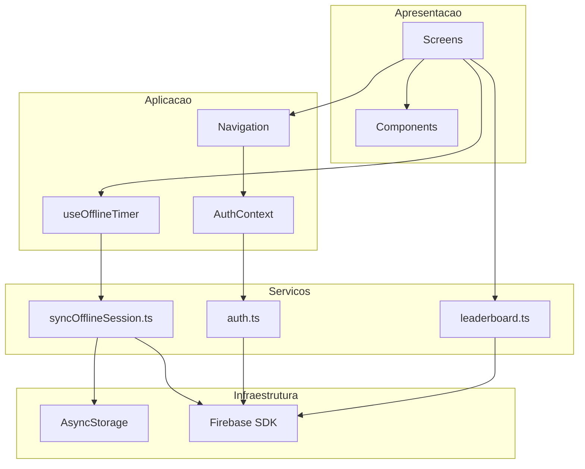
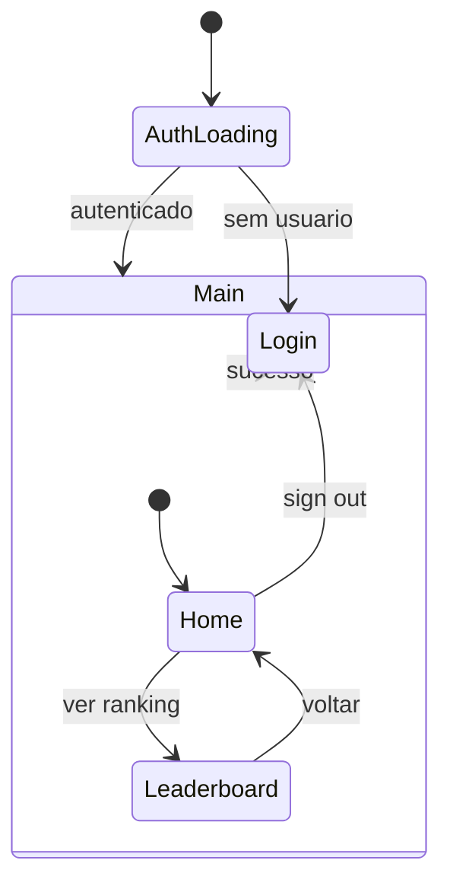
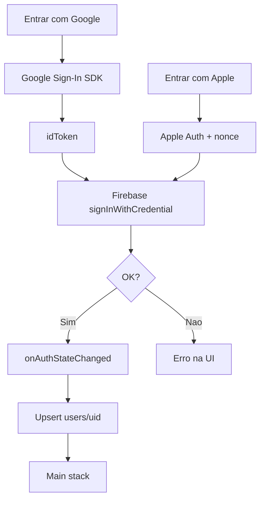

# Arquitetura de aplicação — Minuto Offline

**Fase TOGAF:** D (Application Architecture)

---

## 1. Camadas lógicas



## 2. Estrutura de pacotes TO-BE

```
src/
├── config/
│   └── firebase.ts
├── contexts/
│   └── AuthContext.tsx
├── hooks/
│   └── useOfflineTimer.ts      # existente
├── navigation/
│   └── RootNavigator.tsx
├── screens/
│   ├── HomeScreen.tsx          # existente
│   ├── LoginScreen.tsx
│   └── LeaderboardScreen.tsx
├── components/                 # existente
├── services/
│   ├── auth.ts
│   ├── syncOfflineSession.ts
│   └── leaderboard.ts
└── theme.ts
```

## 3. Componentes

| Componente | Responsabilidade | Status |
|------------|------------------|--------|
| `App.tsx` | Bootstrap, providers | AS-IS: só Home |
| `useOfflineTimer` | Sessões, agregados locais | Implementado |
| `HomeScreen` | UX principal do timer | Implementado |
| `AuthContext` | Estado de autenticação | Planejado |
| `LoginScreen` | OAuth Google/Apple | Planejado |
| `LeaderboardScreen` | Rankings diário/geral | Planejado |
| `syncOfflineSession` | Persistência nuvem | Planejado |

## 4. Navegação



## 5. Fluxo de autenticação



## 6. Integração com timer existente

O hook `useOfflineTimer` deve aceitar `onSessionComplete?: (session: Session) => void` chamado em `stopOffline` após atualizar estado local.

```typescript
// Contrato planejado
export function useOfflineTimer(options?: {
  onSessionComplete?: (session: Session) => void;
}) { /* ... */ }
```

`HomeScreen` injeta callback que chama `syncOfflineSession(session)` se `user` existir.

## 7. Matriz de interfaces

| De | Para | Contrato |
|----|------|----------|
| `LoginScreen` | `AuthContext` | `signInWithGoogle()`, `signInWithApple()` |
| `HomeScreen` | `useOfflineTimer` | `toggle`, métricas |
| `HomeScreen` | `syncOfflineSession` | `Session` + `uid` |
| `LeaderboardScreen` | `leaderboard.ts` | `fetchDaily()`, `fetchAllTime()` |
| `AuthContext` | Firebase Auth | `onAuthStateChanged` |

## 8. Contratos de serviço (esboço)

### `syncOfflineSession.ts`

```typescript
export async function syncOfflineSession(
  uid: string,
  session: Session,
  profile: { displayName: string; photoURL?: string },
): Promise<void>;
```

### `leaderboard.ts`

```typescript
export type LeaderboardEntry = {
  uid: string;
  displayName: string;
  photoURL?: string;
  totalMs: number;
  rank: number;
};

export async function fetchDailyLeaderboard(
  dateKey: string,
  limit?: number,
): Promise<LeaderboardEntry[]>;

export async function fetchAllTimeLeaderboard(
  limit?: number,
): Promise<LeaderboardEntry[]>;
```

## 9. Referências C4

- [Contexto](c4/context.md)
- [Containers](c4/containers.md)
- [Componentes](c4/components.md)
