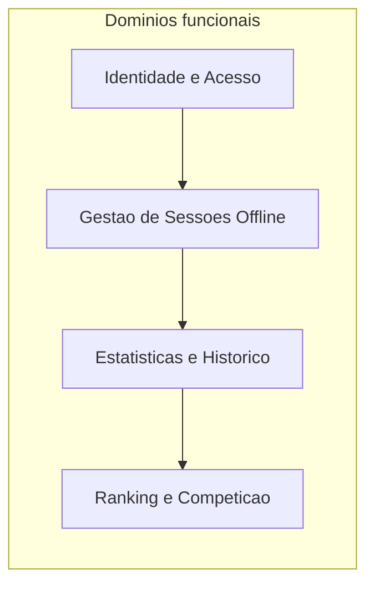
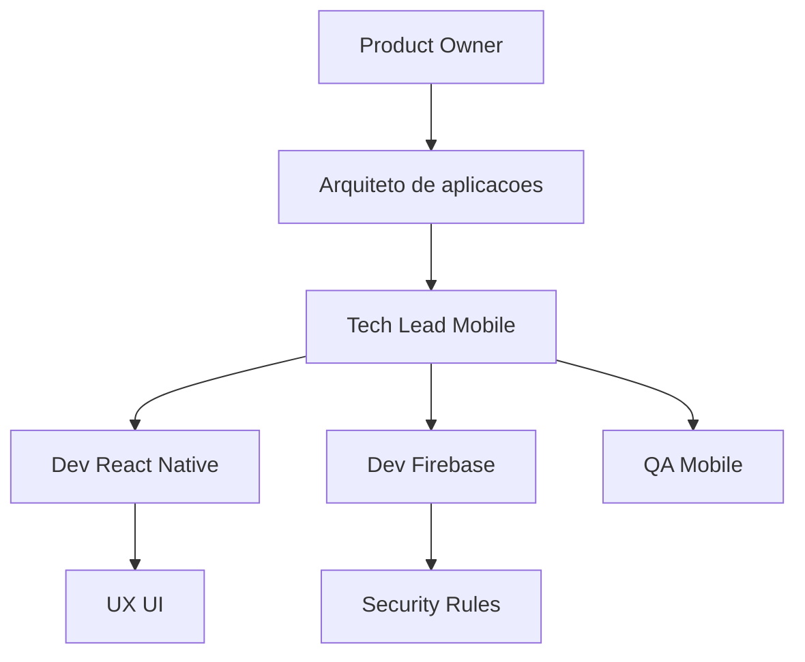
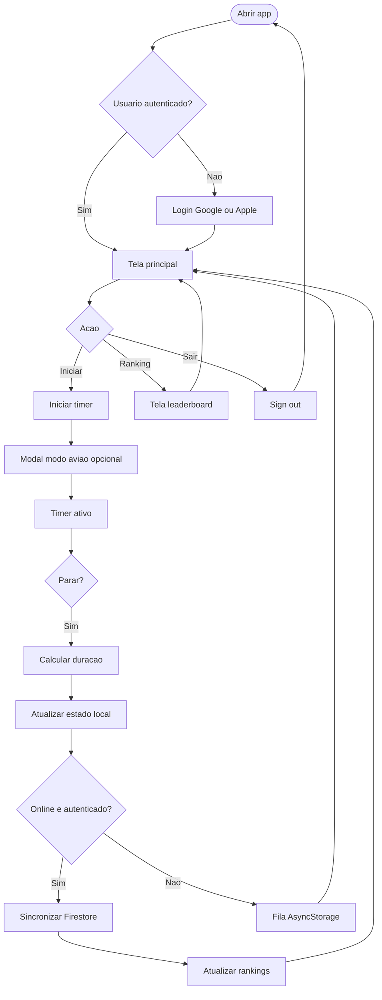

# Arquitetura de negócio — Minuto Offline

**Fase TOGAF:** B (Business Architecture)

---

## 1. Capacidades de negócio

| ID | Capacidade | Descrição | AS-IS | TO-BE |
|----|------------|-----------|-------|-------|
| C1 | Registrar sessão offline | Usuário inicia/para o timer | Sim | Sim + sync |
| C2 | Visualizar estatísticas | Total do dia, contagem, histórico, metáfora “água” | Local | Local + nuvem |
| C3 | Autenticar usuário | Identidade para ranking | Não | Google + Apple |
| C4 | Competir em ranking | Comparar tempo com outros | Não | Diário + geral |
| C5 | Recuperar progresso | Mesmo usuário em outro device | Não | Firestore |

## 2. Organograma funcional do produto

## 3. Organograma da equipe de entrega (referência)

## 4. Processo principal — sessão offline e ranking

## 5. Regras de negócio

| ID | Regra |
|----|-------|
| RN-01 | Uma sessão começa quando o usuário toca em iniciar e termina ao tocar em parar. |
| RN-02 | A métrica de ranking é a soma de `durationMs` de sessões válidas. |
| RN-03 | O ranking **diário** usa a data civil em timezone `America/Sao_Paulo` (ver ADR-003). |
| RN-04 | O ranking **geral** acumula todo o tempo sincronizado do usuário. |
| RN-05 | Sessões só entram no ranking se o usuário estiver autenticado no momento do sync. |
| RN-06 | Duração máxima por sessão: 24 horas (validação em rules). |
| RN-07 | “Offline” no app é intencional do usuário, não verificação automática de modo avião. |

## 6. Métricas e KPIs (sugeridos)

- DAU / MAU autenticados.
- Sessões por usuário por dia.
- Tempo médio de sessão.
- Taxa de sucesso de sync.
- Posição média no ranking (engajamento).

## 7. Glossário

| Termo | Definição |
|-------|-----------|
| Sessão offline | Período entre start e stop do timer no app |
| Score | Total de milissegundos offline acumulados |
| Ranking diário | Top usuários na data corrente (TZ fixa) |
| Ranking geral | Top usuários all-time |
