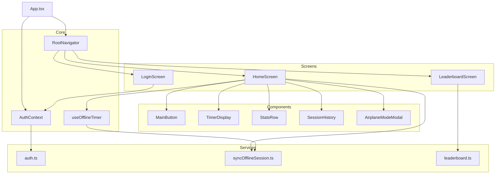
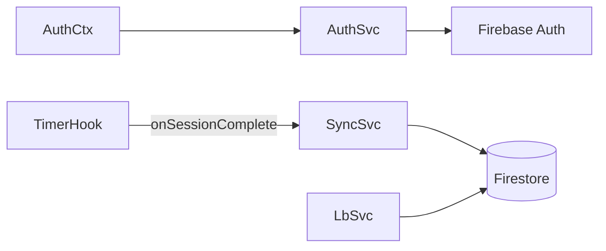

# C4 — Nível 3: Diagrama de componentes (Mobile App)

Detalhamento interno do container **Mobile App**.

---

## Diagrama

## Componentes existentes (AS-IS)

| Arquivo | Função |
|---------|--------|
| `App.tsx` | Entry point |
| `HomeScreen.tsx` | Orquestra UI do timer |
| `useOfflineTimer.ts` | Estado e lógica de sessão |
| `MainButton.tsx` | Toggle start/stop |
| `TimerDisplay.tsx` | Exibição hh:mm:ss |
| `StatsRow.tsx` | Cards estatísticos |
| `SessionHistory.tsx` | Últimas sessões |
| `AirplaneModeModal.tsx` | Atalho configurações |
| `theme.ts` | Design tokens |

## Componentes planejados (TO-BE)

| Arquivo | Função |
|---------|--------|
| `RootNavigator.tsx` | Auth vs Main stacks |
| `AuthContext.tsx` | Sessão global do usuário |
| `LoginScreen.tsx` | Botões OAuth |
| `LeaderboardScreen.tsx` | Abas diário/geral |
| `auth.ts` | Google/Apple sign-in |
| `syncOfflineSession.ts` | Batch Firestore |
| `leaderboard.ts` | Queries ranqueadas |
| `config/firebase.ts` | Inicialização SDK |

## Dependências entre componentes

## Links

- [Aplicação](../application.md)
- [Dados](../data-model.md)
