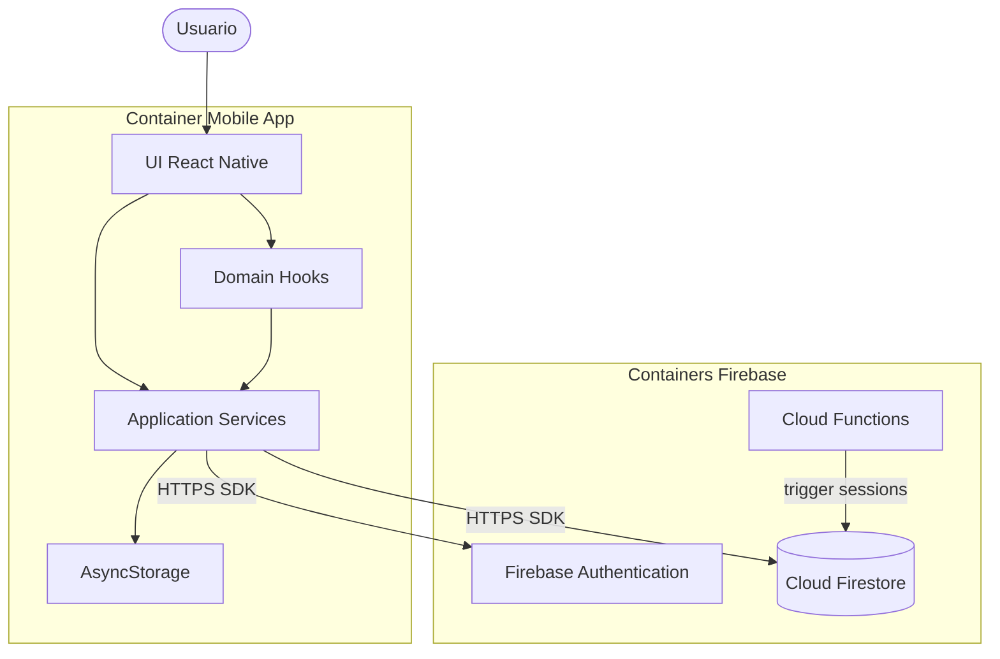

# C4 — Nível 2: Diagrama de containers

Containers são aplicações ou repositórios de dados executáveis/separáveis.

---

## Diagrama

## Catálogo de containers

| Container | Tecnologia | Responsabilidades |
|-----------|------------|-------------------|
| UI React Native | TSX, RN 0.73 | Telas, componentes, navegação |
| Domain Hooks | React hooks | Timer, estado de sessão |
| Application Services | TypeScript | Auth, sync, leaderboard queries |
| AsyncStorage | RN module | Cache, fila offline |
| Firebase Authentication | Google managed | Tokens, provedores OAuth |
| Cloud Firestore | Google managed | Users, sessions, leaderboards |
| Cloud Functions | Node 20 | Agregação segura (fase 2) |

## Comunicação

| Origem | Destino | Protocolo |
|--------|---------|-----------|
| Mobile App | Firebase Auth | TLS, SDK nativo |
| Mobile App | Firestore | TLS, SDK nativo |
| Mobile App | AsyncStorage | API local |
| Cloud Functions | Firestore | Admin SDK |

## Links

- [Contexto](context.md)
- [Componentes](components.md)
- [Tecnologia](../technology.md)
