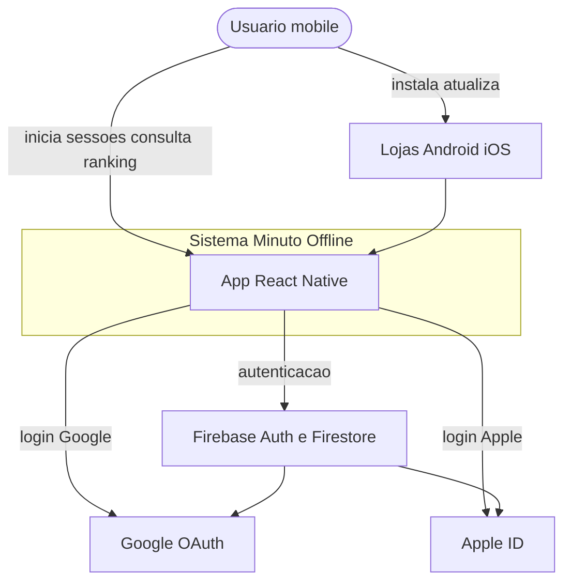

# C4 — Nível 1: Diagrama de contexto

O diagrama de contexto mostra o sistema **Minuto Offline** e suas interações com usuários e sistemas externos.

---

## Diagrama

## Descrição dos atores e sistemas

| Elemento | Tipo | Descrição |
|----------|------|-----------|
| Usuário mobile | Pessoa | Usa o app para registrar tempo offline e ver ranking |
| App React Native | Sistema | Cliente Android/iOS |
| Firebase | Sistema externo | Auth + persistência de scores |
| Google OAuth | Sistema externo | Provedor de identidade |
| Apple ID | Sistema externo | Provedor de identidade (obrigatório no iOS se houver Google) |
| Lojas | Sistema externo | Distribuição e atualizações do app |

## Escopo do sistema

**Dentro da caixa “Minuto Offline”:** lógica de timer, UI, cache local, integração Firebase.

**Fora:** infraestrutura Google Cloud gerenciada pelo Firebase, políticas das lojas, configurações do SO (modo avião).

## Links

- [Containers](containers.md)
- [Visão](../vision.md)
