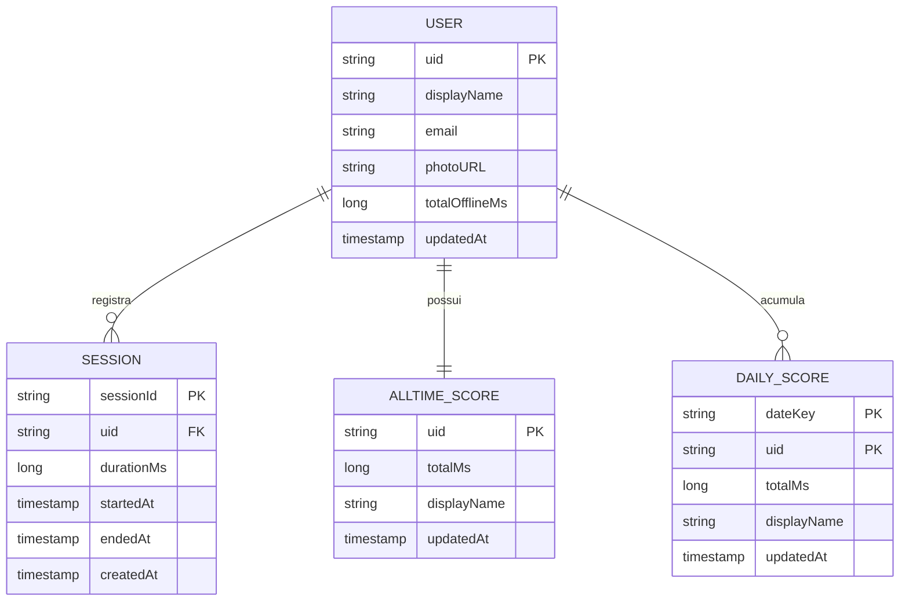
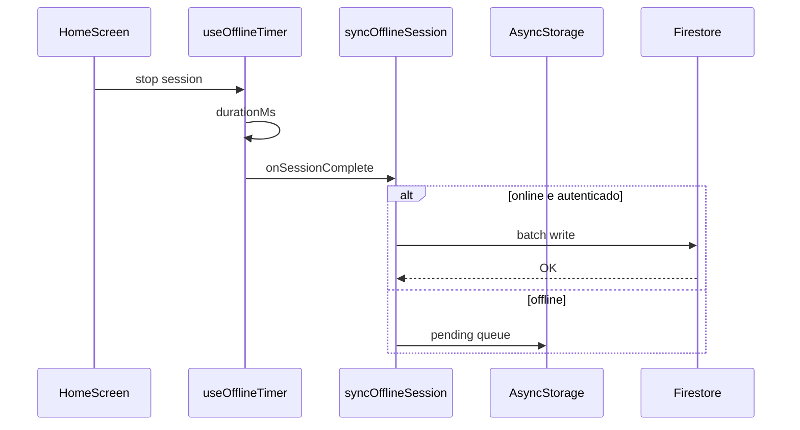

# Arquitetura de dados — Minuto Offline

**Fase TOGAF:** C (Data Architecture)

---

## 1. Modelo conceitual



## 2. Modelo lógico Firestore (TO-BE)

### Coleções

```
users/{uid}
users/{uid}/sessions/{sessionId}
leaderboards/daily/{YYYY-MM-DD}/users/{uid}
leaderboards/allTime/users/{uid}
```

### Documento `users/{uid}`

| Campo | Tipo | Descrição |
|-------|------|-----------|
| `displayName` | string | Nome exibido |
| `email` | string | E-mail (se disponível) |
| `photoURL` | string | URL do avatar |
| `totalOfflineMs` | number | Soma all-time no perfil |
| `updatedAt` | timestamp | Última atualização |

### Documento `users/{uid}/sessions/{sessionId}`

| Campo | Tipo | Descrição |
|-------|------|-----------|
| `durationMs` | number | Duração da sessão |
| `startedAt` | timestamp | Início |
| `endedAt` | timestamp | Fim |
| `createdAt` | timestamp | Escrita no servidor |

### Documento `leaderboards/daily/{dateKey}/users/{uid}`

| Campo | Tipo | Descrição |
|-------|------|-----------|
| `totalMs` | number | Total do dia |
| `displayName` | string | Denormalizado para lista |
| `photoURL` | string | Denormalizado |
| `updatedAt` | timestamp | Última atualização |

### Documento `leaderboards/allTime/users/{uid}`

Mesma estrutura de `totalMs`, `displayName`, `photoURL`, `updatedAt`.

## 3. AS-IS — dados no cliente

Implementação atual em `useOfflineTimer`:

```typescript
interface Session {
  startLabel: string;  // HH:MM no fim da sessão
  duration: string;    // hh:mm:ss formatado
  durationMs: number;
}
```

Estado volátil: `totalTodayMs`, `sessionCount`, `history` (últimas 5 sessões).

## 4. Fluxo de sincronização



### Batch write (transação lógica)

1. `set` em `users/{uid}/sessions/{newId}`.
2. `update` `users/{uid}` com `FieldValue.increment(durationMs)`.
3. `set` merge em `leaderboards/daily/{dateKey}/users/{uid}` com increment.
4. `set` merge em `leaderboards/allTime/users/{uid}` com increment.

## 5. Cache local (AsyncStorage)

| Chave | Conteúdo |
|-------|----------|
| `@minuto/today` | `{ dateKey, totalTodayMs, sessionCount }` |
| `@minuto/history` | Últimas N sessões (JSON) |
| `@minuto/pending_sync` | Fila de sessões não enviadas |

## 6. Índices Firestore

Criar índices compostos quando o console solicitar:

- `leaderboards/daily/{dateKey}/users` — `orderBy('totalMs', 'desc')`
- `leaderboards/allTime/users` — `orderBy('totalMs', 'desc')`

## 7. Governança de dados

| Tópico | Decisão |
|--------|---------|
| Timezone do dia | `America/Sao_Paulo` — [ADR-003](../adr/003-ranking-timezone.md) |
| Unidade de score | Milissegundos (`durationMs`) |
| Retenção de sessões | Manter histórico; política de purge a definir |
| LGPD | Exclusão de `users/{uid}` e subcoleções sob demanda |
| Denormalização | `displayName`/`photoURL` nos leaderboards para query única |

## 8. Queries de leitura

```typescript
// Ranking diário (top 50)
firestore()
  .collection(`leaderboards/daily/${dateKey}/users`)
  .orderBy('totalMs', 'desc')
  .limit(50);

// Ranking geral (top 50)
firestore()
  .collection('leaderboards/allTime/users')
  .orderBy('totalMs', 'desc')
  .limit(50);
```

## 9. Evolução (fase 2)

- Cloud Function `onCreate` em `sessions` para agregar scores (anti-fraude).
- BigQuery export para analytics (opcional).
