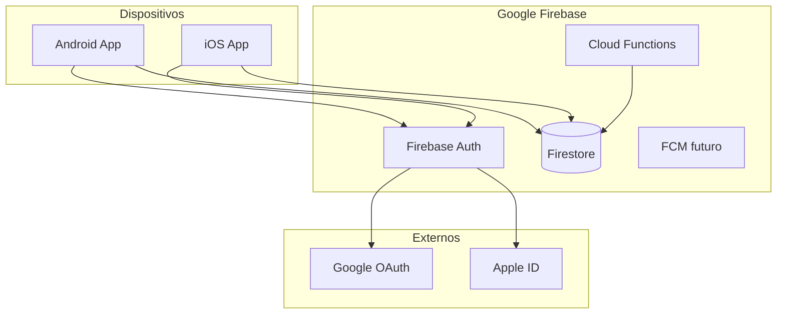
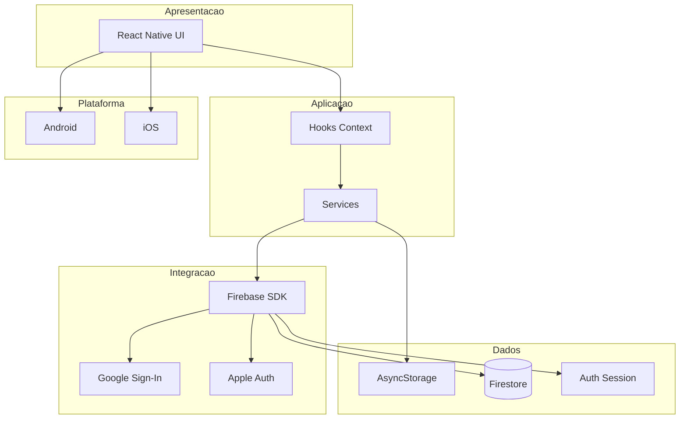
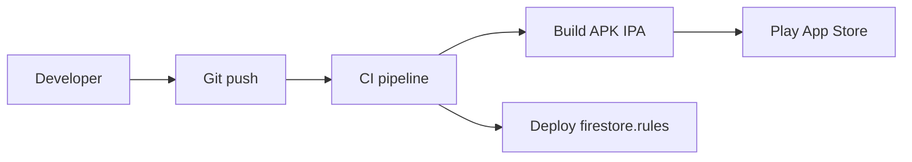

# Arquitetura de tecnologia — Minuto Offline

**Fase TOGAF:** E (Technology Architecture)

---

## 1. Stack tecnológico

| Camada | Tecnologia | Versão / nota |
|--------|------------|---------------|
| Runtime mobile | React Native | 0.73.4 |
| UI | React | 18.2 |
| Linguagem | TypeScript | 5.0 |
| Safe area | react-native-safe-area-context | 4.8+ |
| Navegação | @react-navigation/native, native-stack | 6.x (TO-BE) |
| Auth nuvem | Firebase Authentication | TO-BE |
| Banco nuvem | Cloud Firestore | TO-BE |
| Firebase RN | @react-native-firebase/app, auth, firestore | TO-BE |
| Google OAuth | @react-native-google-signin/google-signin | TO-BE |
| Apple OAuth | @invertase/react-native-apple-authentication | TO-BE |
| Cache local | @react-native-async-storage/async-storage | TO-BE |
| Android | Gradle, Kotlin | existente |
| iOS | Xcode, CocoaPods | existente |
| Bundler | Metro | existente |
| Qualidade | ESLint, Prettier, Jest | existente |
| CI/CD (sugerido) | GitHub Actions + Fastlane | futuro |
| Observabilidade | Crashlytics, Analytics | futuro |
| Serverless (fase 2) | Cloud Functions Node 20 | futuro |

## 2. Diagrama de implantação

## 3. Organograma de camadas tecnológicas

## 4. Requisitos não funcionais

| ID | Requisito | Meta | Mecanismo |
|----|-----------|------|-----------|
| NFR-01 | Disponibilidade backend | 99.9% SLA Firebase | Região Firestore configurada |
| NFR-02 | Latência leaderboard | < 2s em 4G | Query limit 50, índices |
| NFR-03 | Uso offline do timer | Funciona sem rede | Estado local |
| NFR-04 | Consistência eventual | Fila de sync | AsyncStorage + retry |
| NFR-05 | Segurança | OWASP Mobile | Rules, HTTPS, Keychain |
| NFR-06 | Escalabilidade MVP | 10k+ usuários | Firestore auto-scale |
| NFR-07 | Privacidade | LGPD | Consentimento, exclusão |

## 5. Ambientes

| Ambiente | Firebase project | Uso |
|----------|------------------|-----|
| dev | `minuto-offline-dev` | Desenvolvimento local |
| staging | `minuto-offline-stg` | QA, TestFlight / internal track |
| prod | `minuto-offline-prod` | Lojas |

Arquivos nativos por ambiente: `google-services.json`, `GoogleService-Info.plist` (não versionar secrets de prod em repo público).

## 6. Build e release

## 7. Dependências nativas (checklist TO-BE)

### Android

- Plugin Google Services em `android/build.gradle`
- `google-services.json` em `android/app/`
- SHA-1/SHA-256 no console Firebase

### iOS

- `GoogleService-Info.plist` no target
- Pod `Firebase/Auth`, `Firebase/Firestore`
- Capability Sign in with Apple
- URL scheme (reversed client ID)

## 8. Monitoramento sugerido

| Ferramenta | Métrica |
|------------|---------|
| Crashlytics | Crashes por versão |
| Analytics | login, session_start, session_end, leaderboard_view |
| Firestore usage | Reads/writes por dia |

## 9. Referências operacionais

- [Runbook Firebase](../ops/firebase-runbook.md)
- [Threat model](../security/threat-model.md)
