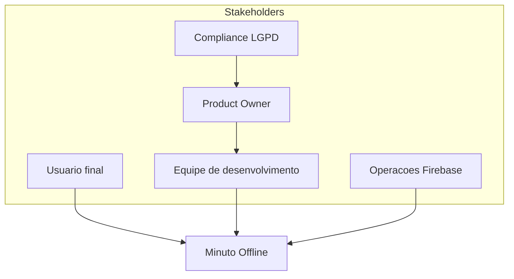
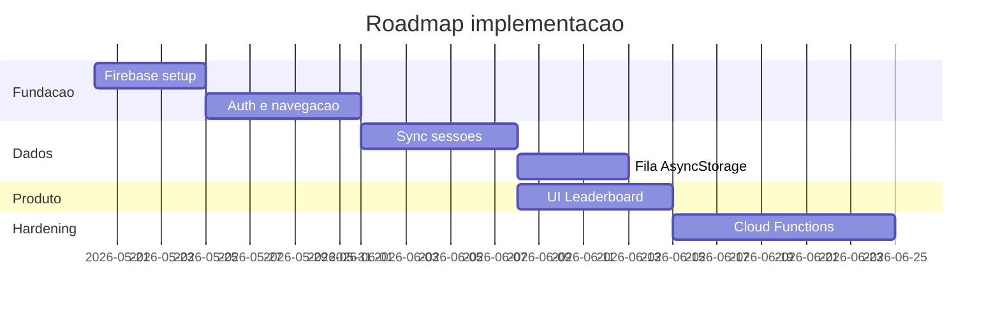

# Visão arquitetural — Minuto Offline

**Versão:** 1.0  
**Data:** 2026-05-20  
**Framework:** TOGAF ADM (visão e fases B–E)

---

## 1. Propósito

O **Minuto Offline** é um aplicativo mobile que registra o tempo em que o usuário permanece intencionalmente “offline” (sessões iniciadas manualmente no app) e, na arquitetura alvo, permite **autenticação social** e **competição em rankings** (diário e geral) com outros usuários.

## 2. Objetivos de negócio

- Incentivar desconexão consciente do celular.
- Medir e exibir estatísticas pessoais (tempo do dia, sessões, histórico).
- Permitir login com Google e Apple (extensível a outros provedores).
- Publicar scores agregados em leaderboards comparáveis.

## 3. Escopo

| Dentro do escopo | Fora do escopo (MVP) |
|------------------|----------------------|
| App React Native (Android/iOS) | Versão web |
| Firebase Auth + Firestore | Backend customizado próprio |
| Rankings diário e all-time | Rankings por amigos / grupos |
| Sync de sessões ao encerrar | Detecção automática de rede via NetInfo |
| Cache local (AsyncStorage) | Admin panel web |

## 4. Estado AS-IS vs TO-BE

### AS-IS (implementado hoje)

- React Native 0.73, TypeScript.
- Timer em [`src/hooks/useOfflineTimer.ts`](../../src/hooks/useOfflineTimer.ts) — estado apenas em memória.
- Tela única [`HomeScreen`](../../src/screens/HomeScreen.tsx) sem autenticação.
- Sem backend, sem persistência, sem ranking.

### TO-BE (arquitetura alvo)

- Firebase Authentication (Google, Apple).
- Cloud Firestore para usuários, sessões e leaderboards.
- Navegação: Login → Home → Leaderboard.
- Sync ao fim da sessão + fila offline em AsyncStorage.
- Regras Firestore em [`firestore.rules`](../../firestore.rules).

## 5. Princípios arquiteturais

1. **Mobile-first** — experiência nativa em Android e iOS.
2. **Offline-first no cliente** — timer funciona sem rede; sync quando possível.
3. **BaaS gerenciado** — Firebase reduz operação no MVP.
4. **Separação em camadas** — UI, domínio (timer), serviços (auth/sync), infra local.
5. **Segurança por identidade** — writes atrelados a `request.auth.uid`.
6. **Evolução incremental** — protótipo → auth → sync → ranking → Cloud Functions.

## 6. Stakeholders

## 7. Roadmap ADM (resumo)

| Fase TOGAF | Entrega |
|------------|---------|
| Preliminar / Visão | Este documento |
| B — Negócio | [business.md](business.md) |
| C — Dados | [data-model.md](data-model.md) |
| D — Aplicação | [application.md](application.md) |
| E — Tecnologia | [technology.md](technology.md) |
| F–H — Implementação | Sprints: Firebase → Auth → Sync → Leaderboard → Hardening |

## 8. Riscos principais

| Risco | Mitigação |
|-------|-----------|
| Timer manual ≠ conectividade real | Documentar regra de negócio; evolução com NetInfo |
| Fraude em scores | `firestore.rules` + Cloud Functions (fase 2) |
| Perda de sessão ao matar app | Background timer + persistir início de sessão |
| Apple exige Sign in with Apple | ADR-002 |
| Custo Firestore | Agregados em leaderboard; índices enxutos |

## 9. Referências

- [README do projeto](../../README.md)
- [Índice da documentação](../README.md)
- [C4 Contexto](c4/context.md)
