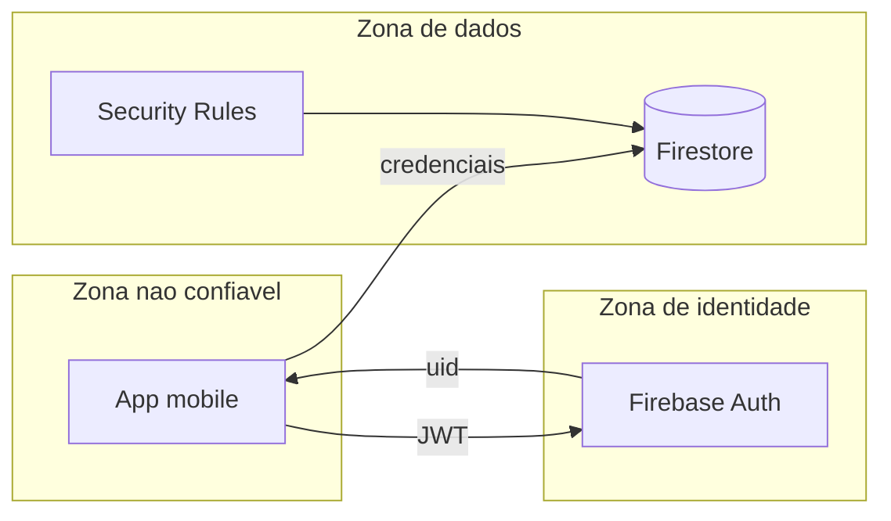

# Threat model — Minuto Offline

**Versão:** 1.0  
**Escopo:** App mobile + Firebase (Auth, Firestore)

---

## 1. Ativos

| Ativo | Sensibilidade |
|-------|---------------|
| Conta do usuário (uid, e-mail) | Média |
| Tokens de sessão Firebase | Alta |
| Histórico de sessões offline | Baixa/média |
| Scores de ranking | Média (integridade) |
| Chaves OAuth (client IDs) | Média |

## 2. Diagrama de zonas de confiança

## 3. STRIDE (resumo)

| Ameaça | Categoria | Descrição | Controle |
|--------|-----------|-----------|----------|
| T1 | Tampering | Usuário altera `totalMs` de outro no Firestore | Rules: `uid == request.auth.uid` |
| T2 | Tampering | Cliente envia `durationMs` inflado | Rules: max 24h/sessão; Functions fase 2 |
| T3 | Spoofing | Login sem OAuth válido | Firebase Auth only |
| T4 | Repudiation | Negar sessão registrada | `createdAt` server timestamp |
| T5 | Info disclosure | Ler e-mails de todos usuários | Leaderboard só campos públicos denormalizados |
| T6 | DoS | Spam de writes | Rate limit App Check (futuro) |
| T7 | Elevation | Escrita em path de outro uid | Rules por path |

## 4. Superfície de ataque

| Superfície | Risco | Mitigação |
|------------|-------|-----------|
| API Firestore direta do cliente | Alto | `firestore.rules` |
| AsyncStorage local | Baixo | Não armazenar refresh token manualmente |
| Deep links OAuth | Médio | Validar redirect URIs |
| APK/IPA repackaged | Médio | Play Integrity / App Attest (futuro) |

## 5. Controles implementados (MVP)

Definidos em [`firestore.rules`](../../firestore.rules):

- Autenticação obrigatória para escrita.
- Usuário só escreve em `users/{uid}` e subpaths próprios.
- Leaderboard entries só pelo próprio `uid`.
- Validação de `durationMs` em sessões.
- Uso de `increment` para agregados (não replace arbitrário de totais).

## 6. Controles planejados (fase 2)

| Controle | Objetivo |
|----------|----------|
| Cloud Function on `sessions` create | Agregar scores no servidor |
| Firebase App Check | Reduzir abuso de API |
| Monitoramento de outliers | Detectar sessões > p99 |
| Exclusão de conta LGPD | Function `deleteUserData` |

## 7. Privacidade (LGPD)

| Requisito | Ação |
|-----------|------|
| Base legal | Consentimento no login |
| Transparência | Política de privacidade na loja |
| Acesso | Export via suporte ou endpoint futuro |
| Exclusão | Apagar `users/{uid}` + subcoleções + leaderboard entries |
| Minimização | Não coletar dados além do necessário para ranking |

## 8. Resposta a incidentes (esboço)

1. Revogar regras permissivas (deploy rules restritivas).
2. Desabilitar provedor comprometido no Firebase Console.
3. Auditar logs de uso Firestore.
4. Comunicar usuários se vazamento de PII.

## 9. Referências

- [ADR-001](../adr/001-firebase-baas.md)
- [firebase-runbook.md](../ops/firebase-runbook.md)
